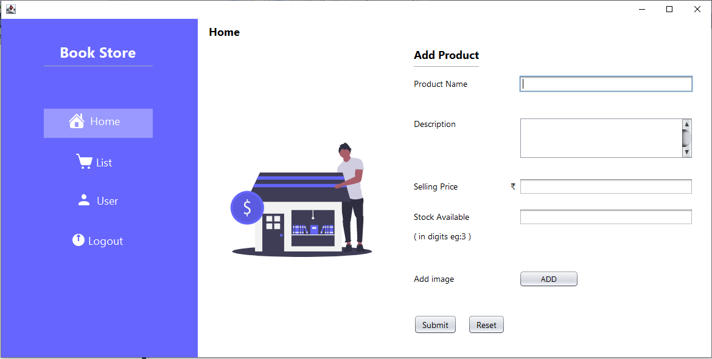
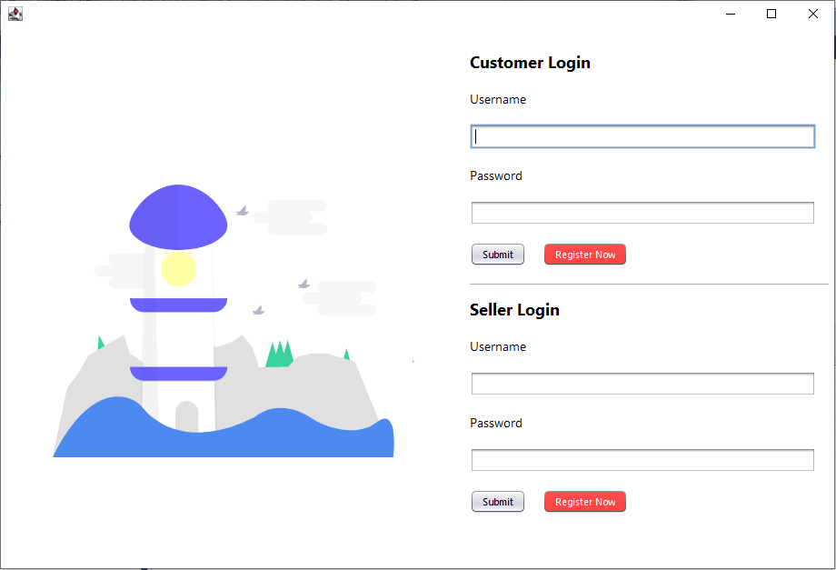
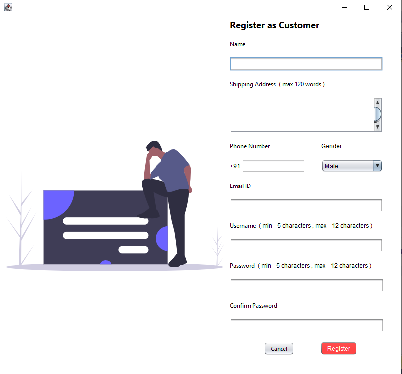

# BookStore

BookStore is desktop based app made by using <b>Java Swing</b>. It tries adapt all the basic features of an online book store. 

## Features
<ol>
    <li>Customer Registration.</li>
    <li>Seller Registration.</li>
    <li>Adding a book to the store from the seller.</li>
    <li>Ordering a book from the store by the customer.</li>
    <li>Email Confirmation message</li>
</ol>

## Frontend

We have used Java Swing for making th UI and handling the different UI features.

## Backend

We have use SQL SERVER for handling and quering the database.

## Screenshots
</img>
</img>
</img>

## Contributing
Pull requests are welcome. For major changes, please open an issue first to discuss what you would like to change.

Please make sure to update tests as appropriate.

